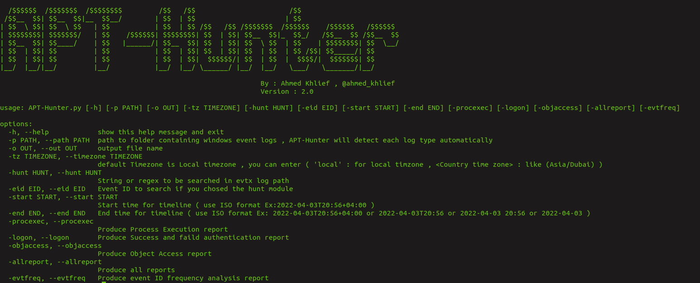
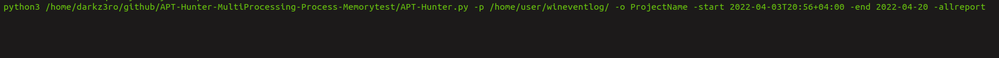
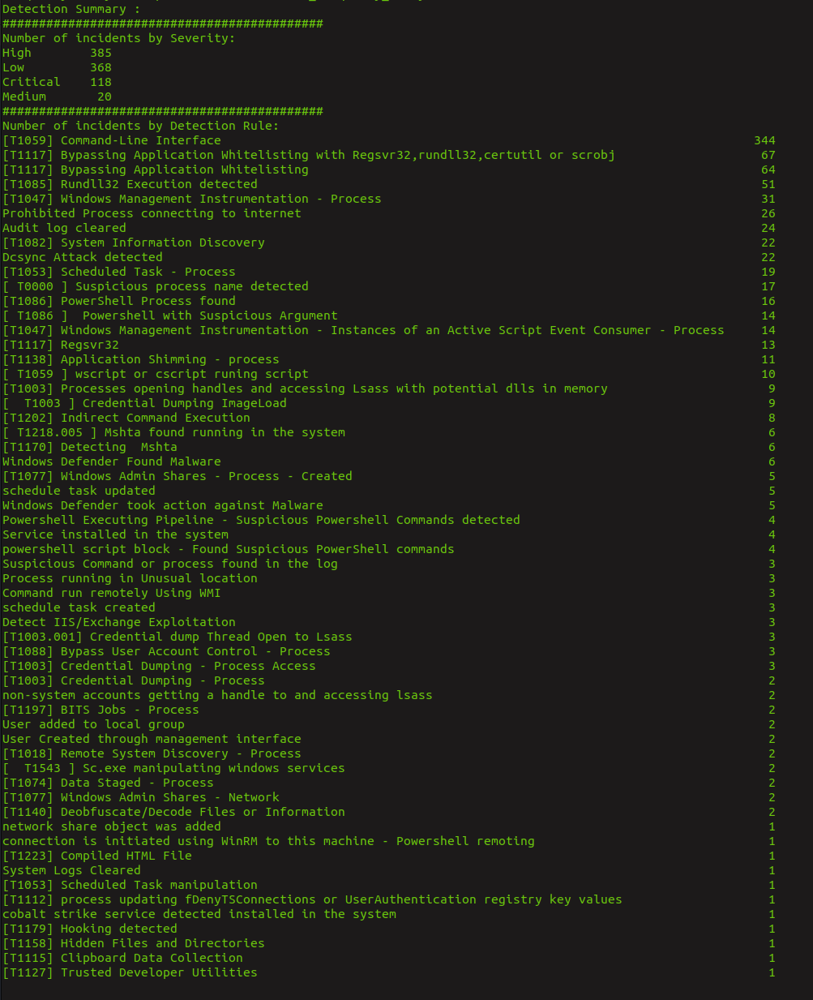
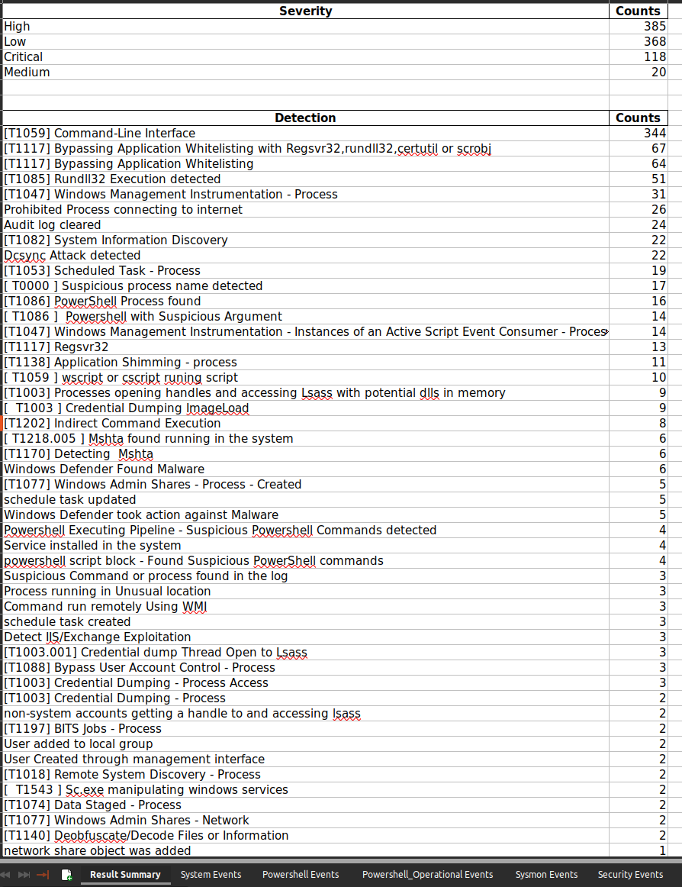
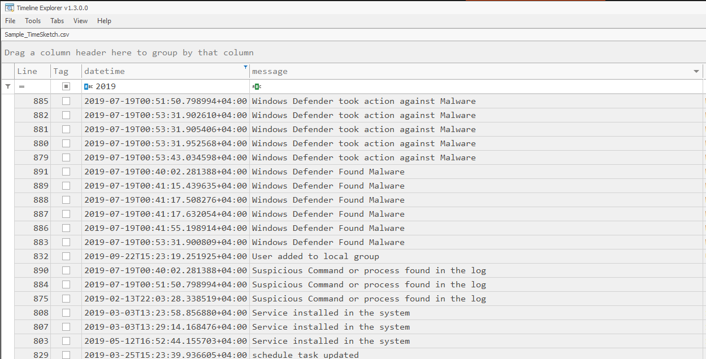

    
    
    
    

# APT-Hunter

APT-Hunter is Threat Hunting tool for windows event logs which made by purple team mindset to detect APT movements hidden in the sea of windows event logs to decrease the time to uncover suspicious activity . APT-Hunter use pre-defined detection rules and focus on statistics to uncover abnormalities which is very effective in compromise assessment . the output produced with timeline that can be analyzed directly from Excel , Timeline Explorer , Timesketch , etc...

Full information about the tool and how its used in this article : [introducing-apt-hunter-threat-hunting-tool-using-windows-event-log](https://shells.systems/introducing-apt-hunter-threat-hunting-tool-via-windows-event-log/)

New Release Info : [APT-HUNTER V3.0 : Rebuilt with Multiprocessing and new cool features](https://shells.systems/apt-hunter-v3-0-rebuilt-with-multiprocessing-and-new-cool-features/)

# Author

Twitter : [@ahmed_khlief](https://twitter.com/ahmed_khlief)

Linkedin : [Ahmed Khlief](https://www.linkedin.com/in/ahmed-khlief-499321a7)

# Donwload APT-Hunter :

Download the latest stable version of APT-Hunter with compiled binaries from [Releases](https://github.com/ahmedkhlief/APT-Hunter/releases) page.

# How to Use APT-Hunter

APT-Hunter built using python3 so in order to use the tool you need to install the required libraries.

`python3 -m pip install -r requirements.txt`

APT-Hunter is easy to use you just use the argument -h to print help to see the options needed .

` python3 APT-Hunter.py -h`

# Exmaples :

Analyzing EVTX files , you can provide directory containing the logs or single file , APT hunter will detect the type of logs .

`python3 APT-Hunter.py    -p /opt/wineventlogs/ -o Project1 -allreport`

Adding time frame to focus on specific timeline :

`python3 APT-Hunter.py    -p /opt/wineventlogs/ -o Project1 -allreport -start 2022-04-03 -end 2022-04-05T20:56`

Hunting using String or regex :

`python3 APT-Hunter.py  -hunt "psexec" -p /opt/wineventlogs/ -o Project2`

`python3 APT-Hunter.py  -huntfile "(psexec|psexesvc)" -p /opt/wineventlogs/ -o Project2`

hunting using file that contain list of regex :

`python3 APT-Hunter.py  -huntfile "huntfile.txt)" -p /opt/wineventlogs/ -o Project2`

Hunting using sigma rules :

`python3 APT-Hunter.py -sigma -rules rules.json -p /opt/wineventlogs/ -o Project2`

Getting Latest sigma rules converted for APT-Hunter ( output will be a file with name rules.json that contain the rules from Sigma repository [Sigma](https://github.com/SigmaHQ/sigma)  ):

Get_Latest_Sigma_Rules.sh

# Output Samples

 : This CSV file you can upload it to timesketch in order to have timeline analysis that will help you see the full picture of the attack .

 : this excel sheet will include all the events detected from every windows logs provided to APT-Hunter.

 : ALl logon events with parsed fields (Date, User , Source IP , Logon Process , Workstation Name , Logon Type , Device Name , Original Log ) as columns.

 : all process execution captured from the event logs.

 : all object access captured from Event (4663) .

 : Collected Users with their SID list to help you in the investigation.

 : EventID frequency analysis report.

# Credits :

I would like to thank [Joe Maccry](https://www.linkedin.com/in/joemccray/) for his amazing contribution in Sysmon use cases ( more than 100 use cases added by Joe )
